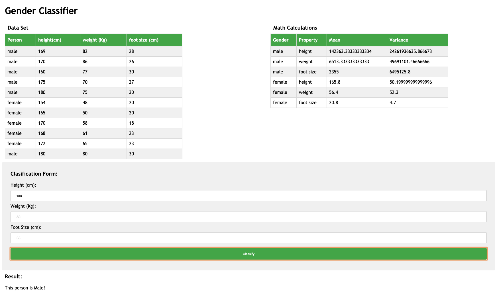

# gender-classifier
A simple machine learning model for classifying people into their genders

It uses Bayes' theorem and conditional probabilities to make predictions.

It makes the assumption that these are independent events which don't affect one another.

